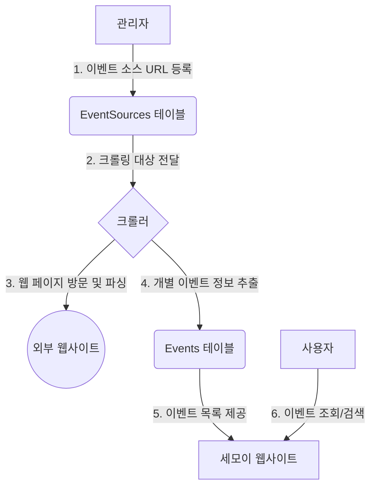

# 세모이(세상 모든 이벤트) 핵심 개념 및 프로세스

이 문서는 세모이 프로젝트의 핵심 도메인 개념과 데이터 처리 흐름을 정의하여, 팀원 모두가 일관된 용어와 프로세스를 이해하고 사용(유비쿼터스 언어)하는 것을 목표로 합니다.

---

## 1. 핵심 어휘 (Ubiquitous Language)

### 1.1. 이벤트 소스 (EventSource)

- **정의**: 크롤러(정보 수집 로봇)가 **이벤트 정보를 수집해 와야 할 출처가 되는 웹 페이지의 주소(URL)**입니다. 관리자에 의해 등록되고 관리됩니다.
- **비유**: 신문 구독 목록. 어떤 신문사(웹사이트)의 어떤 섹션(페이지)을 구독할지 정하는 것과 같습니다.
- **핵심 속성**:
  - `name`: 관리자가 식별하기 위한 소스의 이름 (예: "온오프믹스 IT/기술")
  - `url`: 크롤링 대상 페이지의 실제 주소
  - `is_active`: 현재 이 소스에서 정보를 수집할지 여부
- **테이블명**: `event_sources`

### 1.2. 이벤트 (Event)

- **정의**: `이벤트 소스`로부터 수집된 **실제 이벤트 하나하나의 구체적인 정보**입니다. 이 정보가 최종 사용자에게 보여집니다.
- **비유**: 구독하는 신문에서 오려낸 개별 기사. "OOO 미술관 특별 전시회" 정보 하나하나가 `이벤트`입니다.
- **핵심 속성**:
  - `name`: 이벤트의 공식 명칭 (예: "2025 서울 재즈 페스티벌")
  - `description`: 이벤트에 대한 상세 설명
  - `start_date`: 이벤트 시작 일시
  - `end_date`: 이벤트 종료 일시
  - `url`: 이벤트의 원본 상세 페이지 주소
- **테이블명**: `events`

---

## 2. 데이터 처리 흐름 (Process)

아래는 관리자가 이벤트 소스를 등록하는 시점부터 최종 사용자가 웹사이트에서 이벤트 정보를 조회하기까지의 전체 데이터 흐름을 나타냅니다.

**프로세스 단계별 설명:**

1.  **소스 등록**: `관리자`가 관리자 페이지를 통해 "이 정보를 수집해오세요"라는 의미로 `이벤트 소스`의 URL을 `EventSources` 테이블에 저장합니다.
2.  **대상 전달**: `크롤러`는 주기적으로 `EventSources` 테이블을 확인하여, `is_active` 상태인 소스 목록을 가져와 크롤링 대상을 인지합니다.
3.  **수집 및 분석**: `크롤러`가 `이벤트 소스`의 URL로 실제 HTTP 요청을 보내 웹 페이지의 내용을 가져오고, HTML 구조를 분석(파싱)합니다.
4.  **정보 추출 및 저장**: 분석된 내용 속에서 개별 `이벤트` 정보를 식별하고, 필요한 데이터(이름, 날짜, 설명 등)를 추출하여 `Events` 테이블에 하나씩 저장합니다.
5.  **정보 제공**: `세모이 웹사이트`는 `Events` 테이블에 저장된 데이터를 읽어와 사용자에게 보여줄 목록 페이지나 상세 페이지를 구성합니다.
6.  **사용자 조회**: `사용자`는 웹사이트를 통해 `이벤트` 정보를 검색하거나 상세 내용을 확인합니다.
